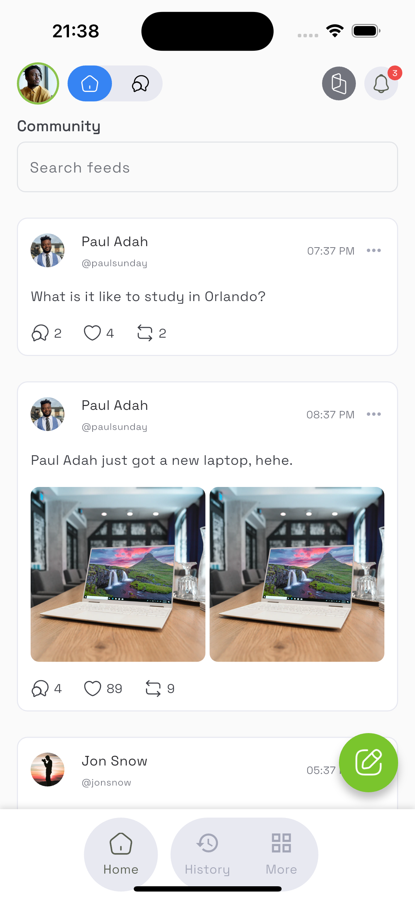
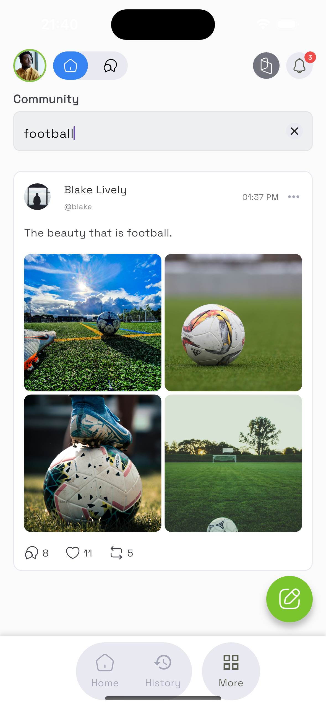
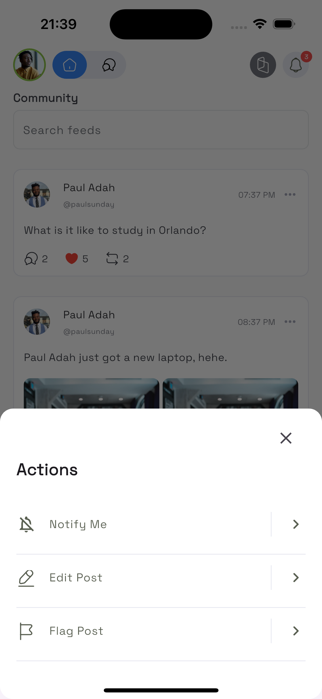
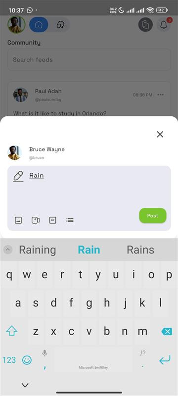
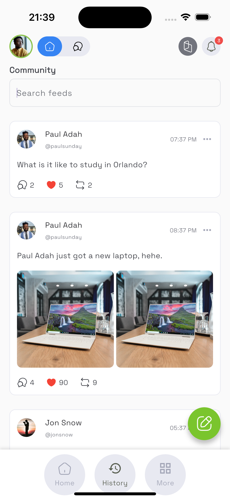
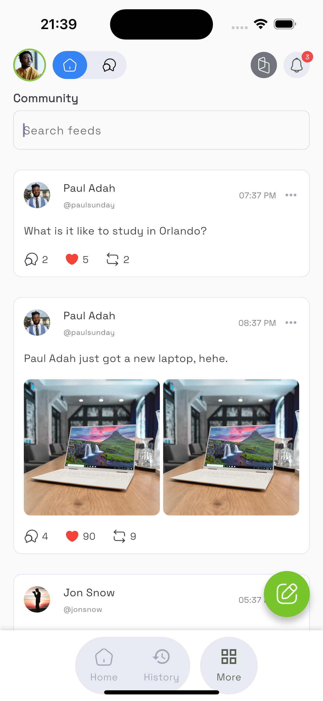
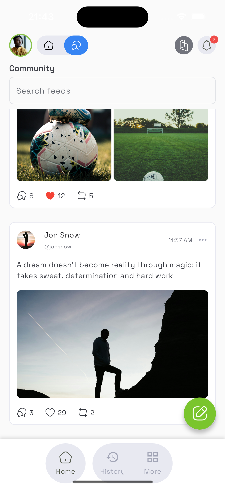
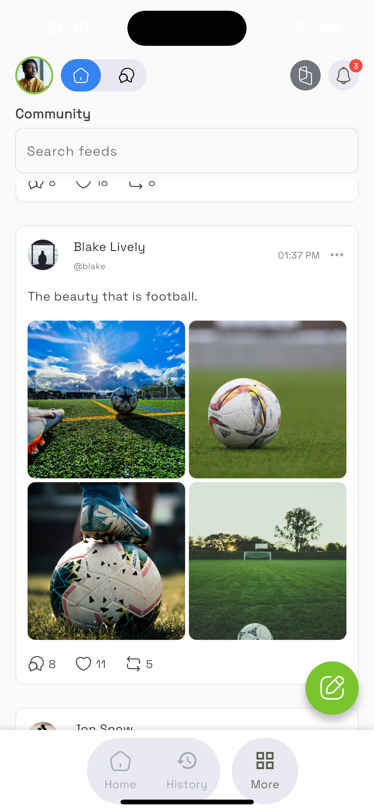
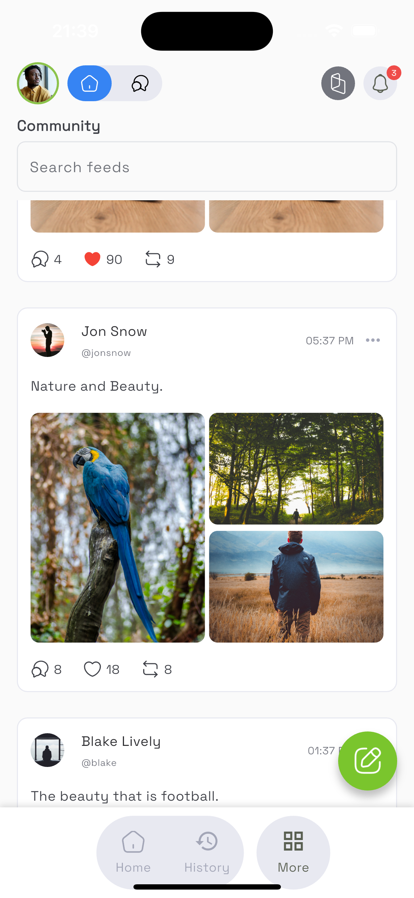
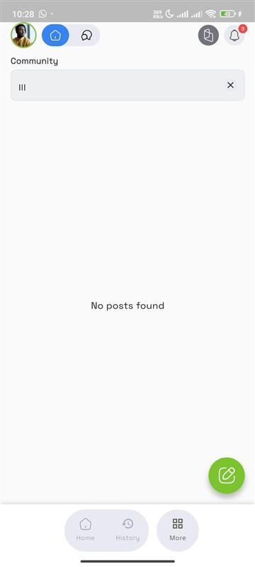

# Flutter Feed App

This is a simple Flutter application demonstrating a social media feed with a search bar. It includes:
- Riverpod for state management
- Like button toggles
- Feed search functionality
- Viewing Feed Images functionality
- Widget tests
- GitHub Actions for CI

## Setup Instructions

1. Clone the repository:
   ```bash
   git clone https://github.com/Davywiz/flutter_feed_app.git
2. Navigate into the project directory:
    cd flutter_feed_app
3. Get dependencies:
    flutter pub get
4. Run the app:
    flutter run
5. Run tests:
    flutter test

## Architecture
Riverpod is used for state management due to its simplicity and testability.
The project is structured into features for clarity and scalability.

## Continuous Integration
 A GitHub Actions workflow (.github/workflows/flutter_test.yml) runs widget tests on each push/pull request to main.
The workflow fails if any test fails, ensuring code quality.


## Demo Video
[Watch the demo](screenshots/demo_007.mp4)


## Screenshots

see /screenshots folder.



### Search Feature


![Other Images]













